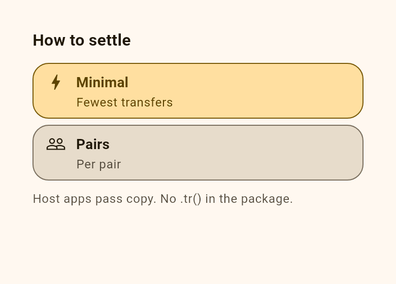
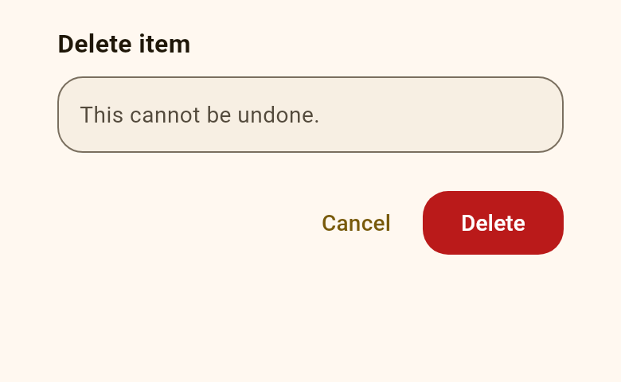
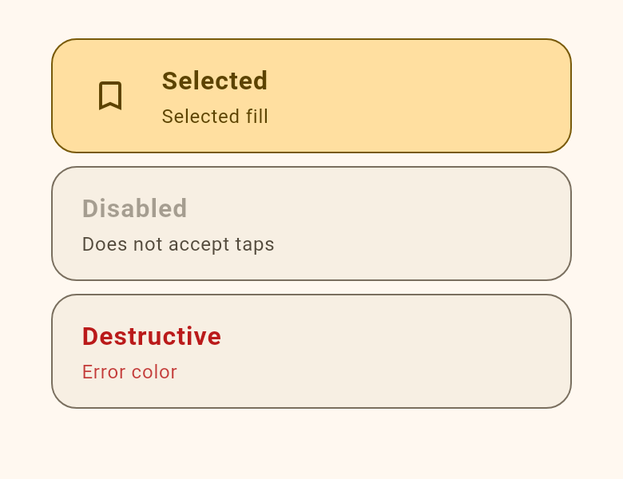
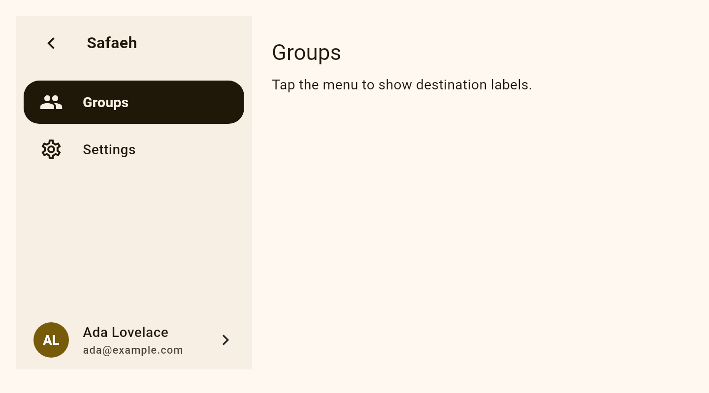
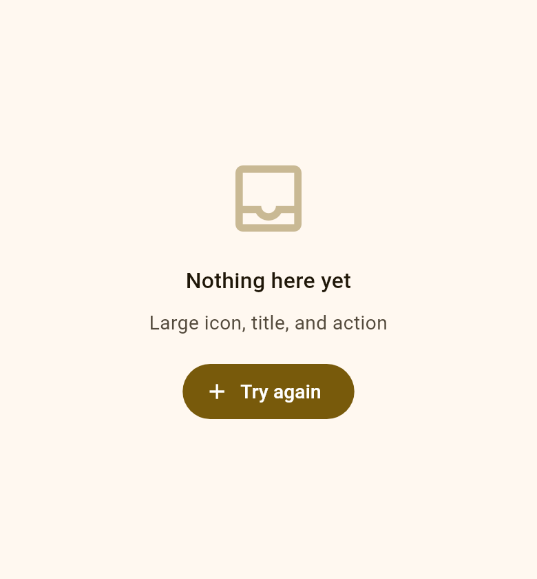
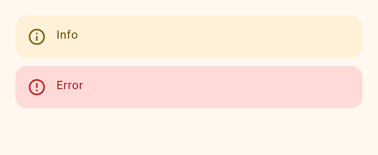
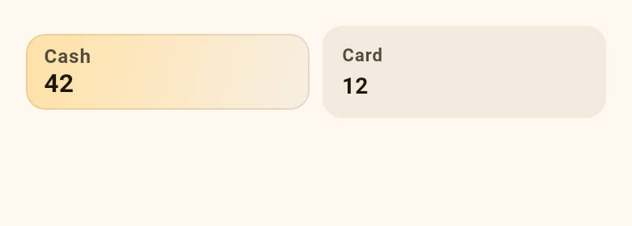
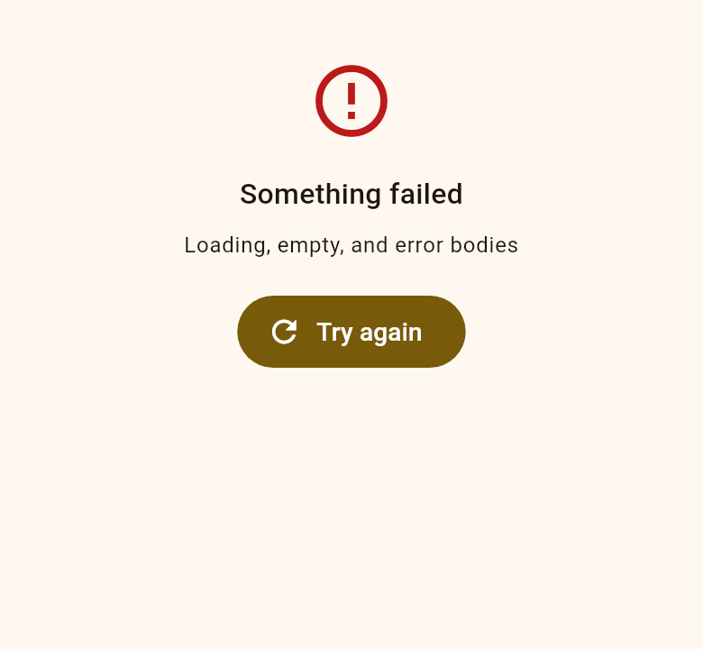

<!-- markdownlint-disable MD033 MD060 -->

<p align="center">
  
</p>

<h1 align="center">Safaeh - صفائح</h1>

<p align="center">
  <strong>safaeh</strong><br/>
  Adaptive sheets, onboarding designs, camera / QR chrome, page index, and sidenav for Flutter —<br/>
host app keeps i18n, routing, and the camera plugin.
</p>

Safaeh is presentation-only: it has no network, cloud, billing, or
authentication-service dependency. Onboarding and auth widgets receive state
and callbacks from the host application.

<p align="center">
  <a href="https://zyzto.github.io/Safaeh/"></a>
</p>

<p align="center">
  <a href="https://pub.dev/packages/safaeh"></a>
  <a href="https://github.com/Zyzto/Safaeh"></a>
  
  <a href="LICENSE"></a>
</p>

<p align="center">
  <strong><a href="https://zyzto.github.io/Safaeh/">Live demo</a></strong>
  — open the example catalog in the browser<br/>
  <a href="https://zyzto.github.io/Safaeh/">zyzto.github.io/Safaeh</a>
</p>

<p align="center">
  <a href="https://zyzto.github.io/Safaeh/">Live demo</a> ·
  <a href="#install">Install</a> ·
  <a href="#quick-start">Quick start</a> ·
  <a href="#widgets">Widgets</a> ·
  <a href="#features-at-a-glance">Features</a> ·
  <a href="#what-stays-in-the-host">Host app</a> ·
  <a href="#example">Example</a> ·
  <a href="CHANGELOG.md">Changelog</a> ·
  <a href="VERSIONING.md">Versioning</a> ·
  <a href="doc/host-integration.md">Host integration</a> ·
  <a href="README.ar.md">العربية</a>
</p>

<p align="center">
  The name <strong>safaeh</strong> comes from Arabic
  <span dir="rtl"><strong>صفائح</strong></span>
  (<em>ṣafāʾiḥ</em>): sheets / plates —
  plural of <span dir="rtl"><em>صفيحة</em></span> (<em>ṣafīḥa</em>).
</p>

---

## Why

Flutter apps accumulate one-off bottom sheets, dialogs, rails, and camera
overlays. Then you need:

- the same route to be a phone sheet and a tablet dialog, and morph when the
  viewport crosses the breakpoint
- chrome that honors `MediaQuery.disableAnimationsOf`
- no `easy_localization`, Riverpod, `go_router`, or `mobile_scanner` inside the
  package

**Safaeh** is that chrome layer. Used in Hisab.

On pub.dev: [`safaeh`](https://pub.dev/packages/safaeh) · Repo: [Zyzto/Safaeh](https://github.com/Zyzto/Safaeh).

---

## Widgets

<p align="center">
  <a href="https://zyzto.github.io/Safaeh/">
    
    
    
  </a>
</p>

<p align="center">
  <sub>Card picker · Confirm · Option tiles — <a href="https://zyzto.github.io/Safaeh/">try them in the live demo</a></sub>
</p>

<p align="center">
  <a href="https://zyzto.github.io/Safaeh/">
    
  </a>
</p>

<p align="center">
  <a href="https://zyzto.github.io/Safaeh/">
    
    
    
    
  </a>
</p>

<p align="center">
  <sub>Empty state · Inline banner · KPI · Async / error — <a href="https://zyzto.github.io/Safaeh/">try them in the live demo</a></sub>
</p>

Captured with [`widgets_to_image`](https://pub.dev/packages/widgets_to_image) (`cd example && flutter test test/widget_images_test.dart`).

---

## Features at a glance

| Area | What you get |
|------|----------------|
| **Onboarding** | Six public presets through `SafaehOnboardingDesign`; `SafaehOnboarding`, design catalog metadata, host-owned steps, trackers, action bars, list items, and generic `SafaehAuthFlow` |
| **Sheets** | `showSafaeh` morphs phone sheet ↔ tablet dialog; `SafaehSheet.enableDrag` toggles phone drag-to-dismiss; `showSafaehPicker` / `SafaehOption` (cards, `enabled`); `showSafaehTilePicker` / `SafaehTileOption` (list rows, search); `showSafaehMultiTilePicker` (multi-select); `showSafaehActionSheet`; `showSafaehInfo`; `showSafaehConfirm`, `showSafaehTimedConfirm`, `showSafaehTextInput`, `SafaehStatusBody`, `SafaehContentPanel`, `buildSafaehSheetShell`, `SafaehOptionList`, `SafaehOptionTile` |
| **Dropdown** | `SafaehAnchoredDropdownChip` / `SafaehDropdownOption` for anchored menus that match the trigger width, with host label and selection-color hooks |
| **Dialog** | `showSafaehDialog` centered panel (`railWidthOf` is ignored for alignment) |
| **Theme** | `SafaehTheme` / `SafaehThemeData` for breakpoint, motion, radius, rail widths, camera compact height, `contentMaxWidth`, desktop band tokens, `sheetBodyInset`, `floatingAppearance`; `copyWith` |
| **Chrome** | `SafaehEmptyState`, `SafaehInlineBanner`, `SafaehMetaChip`, `SafaehGlyphAvatar`, `SafaehKpiCard`, `SafaehBorderedListChrome`, `SafaehSectionHeader`, `SafaehLtrText`, `SafaehUserText`, `SafaehAsyncBody`, `SafaehErrorBody`, `SafaehAccentSurfaces`, `applySafaehMaterialChrome` |
| **Debug** | `showSafaehDebugMenu`, `SafaehDebugMenuFab`, host-registered `SafaehDebugSection`s, `SafaehL10nEditOverlay` behind `SafaehL10nBackend` |
| **Motion** | `safaehResolvedMotion` zeros durations when animations are disabled |
| **Nav** | `SafaehSidenav` temporary drawer (`asDrawer: true`), clipping rail, or overlay rail (`overlay: true`); `SafaehFloatingNavBar` (same `SafaehSidenavDestination`); keyboard-aware bottom-nav metrics and FAB placement |
| **Page index** | `SafaehPageIndex`, overlay, `scrollToPageSection`, `safaehActivePageSectionId` (ids + keys only — no `.tr()` on scroll) |
| **App bar** | `SafaehMorphingAppBar`, `SafaehMorphingAppBarAction`, `SafaehMorphingAppBarBottom` for page-aware title, action, and bottom chrome morphing |
| **Content** | `safaehBandMetrics`, `safaehRailAwareBandMetrics`, `SafaehContentBand` (`railAware`), `SafaehContentAlignedPage`, `SafaehEndAsideLayout`, `SafaehContentAlignedAppBar.forContentArea`, `SafaehContentAlignedFabLocation.of` |
| **Camera** | `showSafaehCameraSheet` / `SafaehCameraSheetHost` paper-roll compact ↔ full |
| **QR chrome** | `SafaehQrScannerOverlay` (optional host `preview`), `SafaehQrTopBar`, `SafaehQrMessageBody`, `SafaehQrFramePainter` |
| **RTL** | `safaehChevronEnd`, `safaehChevronStart`, `safaehArrowBack` (LTR glyphs; Material `matchTextDirection` mirrors them) |

**Core:** Flutter Material only. Preview, decode, copy, and navigation stay in the host.

---

## Install

```yaml
dependencies:
  safaeh: ^0.6.0
```

Or:

```bash
flutter pub add safaeh
```

Git tag pin (see [VERSIONING.md](VERSIONING.md)):

```yaml
dependencies:
  safaeh:
    git:
      url: https://github.com/Zyzto/Safaeh.git
      ref: v0.6.0
```

```dart
import 'package:safaeh/safaeh.dart';
```

Current version: **0.6.0**.
See [doc/chrome.md](doc/chrome.md) and [doc/debug-menu.md](doc/debug-menu.md).

---

## Quick start

### 1. Wrap the app

```dart
SafaehTheme(
  data: const SafaehThemeData(
    tabletBreakpoint: 600,
    dialogMaxWidth: 560,
  ),
  child: MaterialApp(
    home: const MyHome(),
  ),
);
```

Call-sites can still override breakpoint, motion, and transitions.

### 2. Choose a public onboarding design

All six onboarding designs are part of the package. The host chooses the
design and owns persistence, localization, routing, and domain actions:

```dart
SafaehOnboarding(
  design: SafaehOnboardingDesign.orbit,
  steps: [
    SafaehOnboardingStep(
      id: 'welcome',
      titleBuilder: (context) => const Text('Welcome'),
      bodyBuilder: (context) => const Text('Your host-owned content.'),
    ),
  ],
  labels: SafaehOnboardingLabels(
    next: 'Continue',
    stepProgress: (current, total) => '$current / $total',
  ),
  actions: SafaehOnboardingHostActions(
    languageControl: const LanguageButton(),
    themeControl: const ThemeButton(),
    onComplete: () async => SafaehOnboardingResult.completed,
  ),
);
```

Use `SafaehOnboardingDesignCatalog.all` to build a host-owned design picker.
Safaeh does not save the selection. `SafaehAuthFlow` uses the same six
presets for generic sign-in, sign-up, recovery, magic-link, and pending-email
screens; its callbacks are supplied by the host.

### 3. Adaptive sheet

```dart
await showSafaeh<void>(
  context: context,
  title: 'Rename',
  titleBuilder: (context, style) => Text('Rename', style: style),
  child: const TextField(),
);
```

Phone: bottom sheet. Tablet+: centered dialog. The same route morphs when width
crosses `tabletBreakpoint`. Pass `phonePlacement: SafaehPhoneSheetPlacement.center`
to grow the phone sheet so the first content center aligns with the phone
center (still flush with the bottom).

On phone, the whole sheet surface (handle, title, edges) can be dragged down
to dismiss. `enableDrag` sets the initial value; a descendant can change it
later with `SafaehSheet.of(context).enableDrag`. Lists still scroll; a
downward pull at their top edge is handed to the sheet.

### 4. Option picker

```dart
final choice = await showSafaehPicker<int>(
  context: context,
  title: 'How to settle',
  selected: 1,
  options: const [
    SafaehOption(
      value: 1,
      label: 'Minimal',
      subtitle: 'Fewest transfers',
      icon: Icons.bolt_outlined,
    ),
  ],
);
```

The in-body title hides when the viewport is wide (header title only).
`SafaehOption.enabled` greys the card and ignores taps.

### 5. Tile picker (list rows)

```dart
final mode = await showSafaehTilePicker<String>(
  context: context,
  title: 'Import mode',
  titleBuilder: (context, style) => Text('Import mode', style: style),
  header: const Text('12 new · 3 updated'),
  selected: 'add',
  options: const [
    SafaehTileOption(
      value: 'add',
      label: 'Add copies',
      subtitle: 'Keeps existing data',
      leading: Icon(Icons.add_circle_outline),
    ),
    SafaehTileOption(
      value: 'replace',
      label: 'Replace',
      enabled: false,
    ),
  ],
);
```

Uses `SafaehOptionList` + `SafaehOptionTile`. Hosts that already wrap
`showSafaeh` can mount `SafaehTilePickerBody` as the child. Same knobs as
other `showSafaeh*` helpers (`railWidthOf`, `motion`, …).

### 6. Confirm and text input

Host passes action labels. The footer is the commit action only; barrier
tap, drag, and tablet close dismiss. `showSafaehConfirm` returns `true` if
confirmed and `null` if dismissed. Treat only `ok == true` as confirmed.

```dart
final ok = await showSafaehConfirm(
  context: context,
  title: 'Delete item',
  content: 'This cannot be undone.',
  confirmLabel: 'Delete',
  isDestructive: true,
  titleBuilder: (context, style) => Text('Delete item', style: style),
);

final name = await showSafaehTextInput(
  context: context,
  title: 'Tag name',
  doneLabel: 'Done',
  titleBuilder: (context, style) => Text('Tag name', style: style),
);
```

### 7. Centered dialog

```dart
await showSafaehDialog<void>(
  context: context,
  builder: (context) => const Card(child: Text('Hello')),
);
```

### 8. Floating nav and content band

```dart
SafaehFloatingNavBar(
  selectedIndex: index,
  onDestinationSelected: (i) => setState(() => index = i),
  destinations: const [
    SafaehSidenavDestination(
      label: 'Home',
      icon: Icons.home_outlined,
      selectedIcon: Icons.home,
    ),
  ],
);

SafaehContentBand(
  aside: const Text('On this page'),
  child: body,
);
```

When the host owns a floating bottom nav, expose its geometry to overlays and
FABs instead of repeating offsets. The visual inset is intentionally smaller
than the scroll-content inset:

```dart
SafaehBottomNavScope(
  child: Stack(
    children: [
      body,
      SafaehPageIndexOverlay(
        title: 'On this page',
        entries: entries,
        activeId: activeId,
        onSelect: onSelect,
      ),
    ],
  ),
);

final fabLocation = SafaehBottomNavAwareFabLocation.resolve(
  context,
  base: FloatingActionButtonLocation.endFloat,
);
```

Use `SafaehFloatingNavBar(hideWhenKeyboardVisible: true)` when the shell nav
should disappear while the IME is open. Set the shell scaffold's
`resizeToAvoidBottomInset` to `false` so the chrome does not jump during the
keyboard transition. `SafaehBottomNavMetrics` exposes separate visual and
content insets for custom layouts.

`SafaehContentBand` centers from incoming constraints and hides `aside` when
narrow (`SafaehThemeData.isWide`). Hosts with a sibling shell rail keep their
own `leftOffset` / `bandWidth` math and use `SafaehEndAsideLayout`.

### 9. Morphing app bar

Drive one shell app bar from the live `PageController.page`. Safaeh
crossfades adjacent host-provided titles, keeps a stable action slot, and
lets the host fade actions or bottom chrome at the same page position:

```dart
SafaehMorphingAppBar(
  page: pageController.page ?? 0,
  titles: const [
    Text('Home'),
    Text('Statistics'),
    Text('Settings'),
  ],
  // Reserve the leading slot when actions should not move the title.
  leading: const SizedBox(width: kToolbarHeight),
  actionsBuilder: (context, page) => Stack(
    alignment: AlignmentDirectional.center,
    children: [
      SafaehMorphingAppBarAction(
        page: page,
        targetPage: 0,
        child: IconButton(
          onPressed: openHome,
          icon: const Icon(Icons.home_outlined),
        ),
      ),
      SafaehMorphingAppBarAction(
        page: page,
        targetPage: 2,
        child: IconButton(
          onPressed: openSettings,
          icon: const Icon(Icons.settings_outlined),
        ),
      ),
    ],
  ),
  bottom: SafaehMorphingAppBarBottom(
    factor: (2 - (pageController.page ?? 0)).clamp(0.0, 1.0).toDouble(),
    height: 48,
    child: const Center(child: Text('Range controls')),
  ),
);
```

`titles` and all action text stay in the host, so localization and routing do
not enter Safaeh. `page` is clamped to the title range before the action
builder runs. `SafaehMorphingAppBarAction` uses linear page distance for its
opacity and ignores taps below its interactive threshold. The bottom helper
clips and resizes its child while reporting the matching preferred height.
See [host integration](doc/host-integration.md#pinned-morphing-app-bar) and
the `Morphing app bar` catalog entry in `example/`.

### 10. Shared feedback

Mount one host around the app navigator. The host owns the feedback overlay,
surface treatment, animation, safe-area handling, and optional bottom-nav
clearance; the app still owns translated copy and domain callbacks:

```dart
SafaehFeedbackHost(
  itemWidthBuilder: (context) => MediaQuery.sizeOf(context).width - 32,
  bottomInsetBuilder: (context) => 72,
  child: MaterialApp.router(routerConfig: router),
);

context.showSafaehFeedback(
  'Saved',
  type: SafaehFeedbackType.success,
);

context.showSafaehFeedbackWithAction(
  'Deleted',
  actionLabel: 'Undo',
  onAction: undo,
);
```

Use `showSafaehCustomFeedback` for app-specific content while retaining the
same host placement and dismissal contract. Keep localization, reporting,
and business state in the host app.

Band metrics for other apps (app bar, FAB, aside):

```dart
final metrics = safaehBandMetrics(
  contentAreaWidth: constraints.maxWidth,
  maxWidth: 600,
);

SafaehContentAlignedAppBar(
  leftOffset: metrics.leftOffset,
  bandWidth: metrics.bandWidth,
  title: const Text('Title'),
);

SafaehContentAlignedFabLocation.resolve(
  leftOffset: metrics.leftOffset,
  bandWidth: metrics.bandWidth,
  endFree: metrics.endFree,
  textDirection: Directionality.of(context),
);
```

See [doc/host-integration.md](doc/host-integration.md).

### 11. Overlay sidenav

For a sidenav that expands over the page without reserving layout width, put
the overlay rail above the host content in a `Stack`:

```dart
Stack(
  fit: StackFit.expand,
  children: [
    const PageBody(),
    SafaehSidenav(
      overlay: true,
      collapsed: collapsed,
      onToggleCompact: () => setState(() => collapsed = !collapsed),
      floatingAppearance: const SafaehFloatingAppearance(
        style: SafaehFloatingSurfaceStyle.glass,
      ),
      title: 'Safaeh',
      selectedIndex: index,
      onDestinationSelected: onDestinationSelected,
      destinations: destinations,
    ),
  ],
);
```

The overlay inherits `SafaehThemeData.floatingAppearance` when the direct
value is omitted. Its scrim, if needed, remains host-owned.

### 12. Shared floating-surface appearance

Package-owned floating chrome can inherit one appearance from
`SafaehThemeData`, or override it on an individual widget or call:

```dart
const appearance = SafaehFloatingAppearance(
  style: SafaehFloatingSurfaceStyle.glass,
  transparency: 48, // 0 = opaque, 100 = fully transparent
  blurSigma: 18,
  tintColor: Color(0xFFF7F0E5),
);

SafaehTheme(
  data: const SafaehThemeData(floatingAppearance: appearance),
  child: const MyApp(),
);

SafaehFloatingNavBar(
  floatingAppearance: const SafaehFloatingAppearance(
    style: SafaehFloatingSurfaceStyle.vista,
  ),
  selectedIndex: index,
  onDestinationSelected: (i) => setState(() => index = i),
  destinations: destinations,
);
```

The presets are `solid`, `translucent`, `glass` (iOS-like), and `vista`
(Vista/Aero-like). `transparency`, `blurSigma`, `tintColor`, `border`, and
`shadows` are nullable preset overrides. For sheets and dialogs, a call wins
over `SafaehRouteOptions.floatingAppearance`, which wins over the theme:

When `tintColor` is omitted, `glass` uses the active theme surface as a
white-ish frosted tint in light themes and the matching dark surface in dark
themes. Set `tintColor` when a host wants a branded glass color.

```dart
await showSafaeh<void>(
  context: context,
  route: const SafaehRouteOptions(
    floatingAppearance: SafaehFloatingAppearance(
      style: SafaehFloatingSurfaceStyle.translucent,
    ),
  ),
  floatingAppearance: const SafaehFloatingAppearance(
    style: SafaehFloatingSurfaceStyle.glass,
  ),
  child: const MySheetBody(),
);
```

The treatment applies to package-owned shells: the floating nav, overlay
sidenav, narrow page-index trigger/popover, sheet and dialog shells, camera
panel, and QR top bar. Scrims, previews, host children, QR message content,
wide page-index rails, and host-owned FABs remain unchanged. With no appearance
configured, existing rendering is retained, including the floating nav's
transparent default.

### 13. Camera / QR chrome

```dart
await showSafaehCameraSheet<void>(
  context: context,
  builder: (context, sheet) => MyPreview(
    expanded: sheet.expanded,
    onToggle: sheet.toggleExpanded,
    onClose: sheet.dismiss,
  ),
);
```

Embed on a route with `SafaehCameraSheetHost` (omit `openAnimation`, pass
`onDismiss`). Put `SafaehQrScannerOverlay` / `SafaehQrMessageBody` **inside**
that bottom panel — they are full-bleed overlays, not their own sheet.
Keep `mobile_scanner` in the app.

---

## What stays in the host

| Concern | Stays in the app |
|---------|------------------|
| Copy | `easy_localization`, `UserText`, `titleBuilder` |
| Routing | `go_router`; floating sheets stay viewport-centered |
| Camera | `mobile_scanner`, permissions, `SystemChrome` orientation lock |
| State | Riverpod / whatever the app already uses |
| Tiles | `UserText` + optional accent colors on `SafaehOptionTile` |

---

## UI inventory

**Sheets:** `showSafaeh`, `SafaehSheet`, `SafaehRouteOptions`, `showSafaehPicker`, `SafaehOption`, `SafaehOptionPickerBody`, `showSafaehTilePicker`, `showSafaehMultiTilePicker`, `SafaehTileOption`, `SafaehTilePickerBody`, `SafaehTileBuilder`, `showSafaehConfirm`, `SafaehConfirmSheet`, `showSafaehTextInput`, `SafaehTextInputSheet`, `SafaehStatusBody`, `buildSafaehSheetShell`, `SafaehOptionList`, `SafaehOptionTile`, `kSheetContentPadding`, `kSafaehSheetPadding`, `SafaehTitleBuilder`, `SafaehLabelBuilder`, `safaehTitleFromLabel`, `safaehPop`, `SafaehTransition`, `safaehFadeScale`, `safaehFade`, `SafaehPhoneSheetPlacement`, `safaehPhoneCenterSheetTop`

**Dialog:** `showSafaehDialog`

**Camera:** `showSafaehCameraSheet`, `SafaehCameraSheetHost`, `SafaehCameraSheet`, `SheetHandleBar`, `SheetHandleDrag`

**QR:** `SafaehQrScannerOverlay`, `SafaehQrTopBar`, `SafaehQrMessageBody`, `SafaehQrFramePainter`

**Shell:** `SafaehSidenav`, `SafaehSidenavDestination`, `SafaehSidenavProfile`, `SafaehSidenavAvatar`, `SafaehFloatingNavBar`, `SafaehPageIndex`, `SafaehPageIndexOverlay`, `scrollToPageSection`, `safaehActivePageSectionId`, `SafaehMorphingAppBar`, `SafaehMorphingAppBarAction`, `SafaehMorphingAppBarBottom`, `safaehBandMetrics`, `safaehRailAwareBandMetrics`, `SafaehContentBand`, `SafaehContentAlignedPage`, `SafaehEndAsideLayout`, `SafaehContentAlignedAppBar`, `SafaehContentAlignedFabLocation`

**Chrome:** `SafaehEmptyState`, `SafaehInlineBanner`, `SafaehBannerTone`, `SafaehMetaChip`, `SafaehGlyphAvatar`, `SafaehKpiCard`, `SafaehBorderedListChrome`, `SafaehSectionHeader`, `SafaehLtrText`, `SafaehUserText`, `SafaehAsyncBody`, `SafaehLoadingBody`, `SafaehErrorBody`, `SafaehAccentStyle`, `SafaehAccentSurfaces`, `applySafaehMaterialChrome`, `scaleSafaehTextTheme`, `SafaehSemanticStatus`

**Debug:** `showSafaehDebugMenu`, `SafaehDebugMenuFab`, `SafaehDebugMenuBody`, `SafaehDebugSection`, `SafaehL10nEditOverlay`, `SafaehL10nBackend`, `SafaehL10nOverrideStore`

**Tokens:** `SafaehTheme`, `SafaehThemeData`, `SafaehThemeData.copyWith`, `safaehResolvedMotion`, `kSafaehCameraCompactHeightFraction`, `sheetBodyInset`, `sheetBodyInsetWide`

**RTL:** `safaehChevronEnd`, `safaehChevronStart`, `safaehArrowBack`

---

## Architecture

```
┌─────────────────────────────────────────────────────────────┐
│         Host app (i18n, GoRouter, camera, UserText)         │
└─────────────────────────────┬───────────────────────────────┘
                              │
┌─────────────────────────────▼───────────────────────────────┐
│                      SafaehTheme                             │
│   breakpoint · motion · radius · rail · camera fraction     │
└─────────────────────────────┬───────────────────────────────┘
                              │
┌─────────────────────────────▼───────────────────────────────┐
│  showSafaeh / picker / confirm / text / dialog              │
│  SafaehSidenav · floating nav · page index · content band   │
│  camera sheet host · QR overlay chrome                      │
└─────────────────────────────┬───────────────────────────────┘
                              │
┌─────────────────────────────▼───────────────────────────────┐
│              Flutter Material (no Riverpod)                 │
└─────────────────────────────────────────────────────────────┘
```

---

## Example

**[Live demo — zyzto.github.io/Safaeh](https://zyzto.github.io/Safaeh/)**

The hosted catalog is the `example/` web build. CI deploys it after tests pass
on `main`.

A Riverpod-free catalog lives in [`example/`](example/) — same split as
[Edadat](https://github.com/Zyzto/Edadat): `catalog.dart` (en / ar / ja / zh / es),
`app.dart` (theme + home), and a vertical `SafaehContentBand` gallery of every
public API. Section titles open the standalone demo; wide bands use extra
columns on the same page. Language and theme toggles, no `mobile_scanner`.

The example is package-style (web only in-tree); analyze with:

```bash
cd example && flutter pub get && dart analyze --fatal-infos && flutter test
```

`example/test/widget_images_test.dart` writes widget PNGs to [`screenshots/`](screenshots/).

To run on a device, generate the other platforms (`flutter create . --platforms=android,ios` inside `example/`). Details: [example/README.md](example/README.md).

Package tests:

```bash
dart analyze --fatal-infos && flutter test
```

---

## Branding

The logo wordmark uses **[Baz](https://www.1001fonts.com/baz-font.html)** (Baz Light) — the same Arabic typeface as [Edadat](https://github.com/Zyzto/Edadat) and [Siglat](https://github.com/Zyzto/Siglat). The SVG outlines <span dir="rtl">صــفائح</span> (tatweel after <span dir="rtl">ص</span>) so GitHub renders without loading the font. Baz is not registered as a package font and the OTF is not shipped.

---

## Versioning

See [VERSIONING.md](VERSIONING.md) and [CHANGELOG.md](CHANGELOG.md). Tags are `vX.Y.Z` and must match `pubspec.yaml`.

---

## License

[MPL-2.0](LICENSE) — weak copyleft, commercial use allowed. Modified package
files stay under MPL; your app can remain closed-source.
